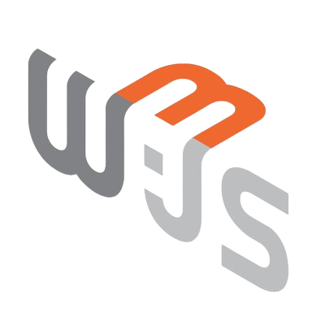
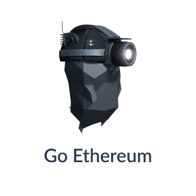
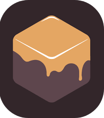
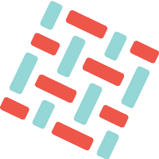
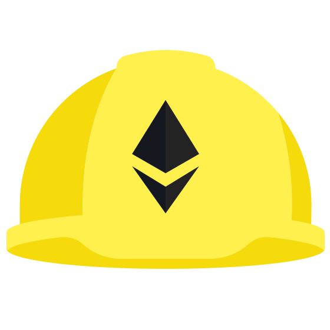
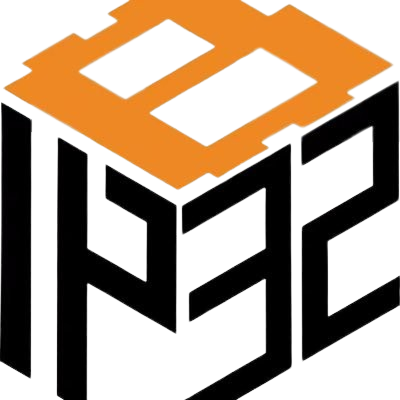
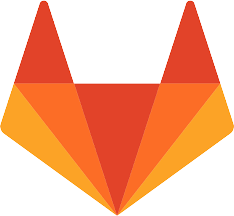

<h1 align="center">Hi there, I'm Alessandro.  Welcome to my GitHub profile  </h1>

<h2>
 👨🏻‍💻 About me:
</h2>

📚 <b>Blockchain Developer</b>, <b>CyberSecurity Master student</b> at the University of Salerno and <b>CyberChallenge.IT</b> 2024 finalist 💻, passionate about computer science and, therefore, also about innovation ⚡.  🚀 In this regard, I am always looking for new stimuli and new technologies to explore. 
🎯 In recent years my interest has shifted towards the world of Blockchain and Web 3.0  
🔐 I decided to delve into the issues of security and privacy in the blockchain field. Therefore, I chose to dedicate my master's thesis to <b>Zero Knowledge Proof</b> and the <b>auditing</b> of smart contracts that use them 

<h2>
 🛠 My programming language skills:
</h2>

### Back End:

### Front End:

### Blockchain Skills, Tools and Libraries:

### ❣️ Let's get connected:

 
 
 

