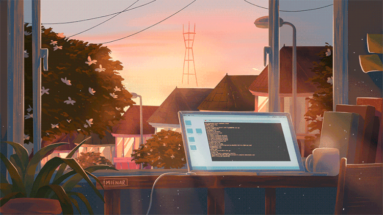
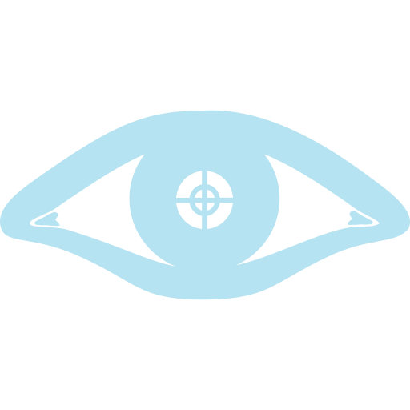
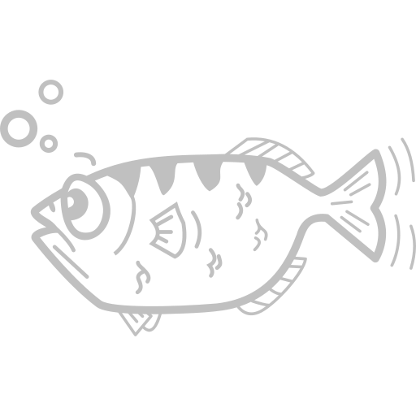
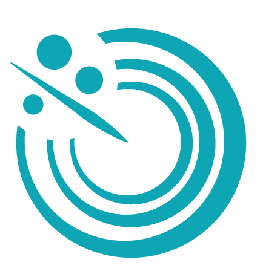
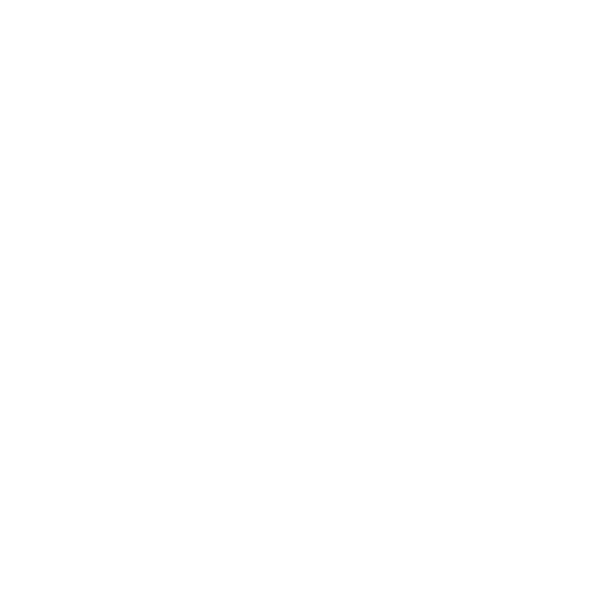

<h1 align="center">Hi there, I'm Alessandro.  Welcome to my GitHub profile  </h1>

📚 <b>Blockchain Developer</b>, <b>Graduated MSc in Cybersecurity</b> at the University of Salerno and <b>CyberChallenge.IT</b> 2024 finalist 💻, Passionate about computer science and innovation ⚡.  🚀 I am constantly seeking new challenges and emerging technologies to explore. 
🎯 In recent years my interest has shifted towards the world of Blockchain and Web 3.0  
🔐 For my Master's Thesis I developed a research system written in Rust exploring <b>Zero-Knowledge Proofs</b> and <b>Zero-Knowledge Virtual Machines</b> for privacy-preserving smart contract vulnerability disclosure. The framework enables verifiable exploit demonstration without disclosing vulnerability details.
 

<h2>
 🛠 My technical skills:
</h2>

### Back End:

### Front End:

### Cyber Security Tools :

### Blockchain Skills, Tools and Libraries:

### ❣️ Let's get connected:

 
 
 
 

